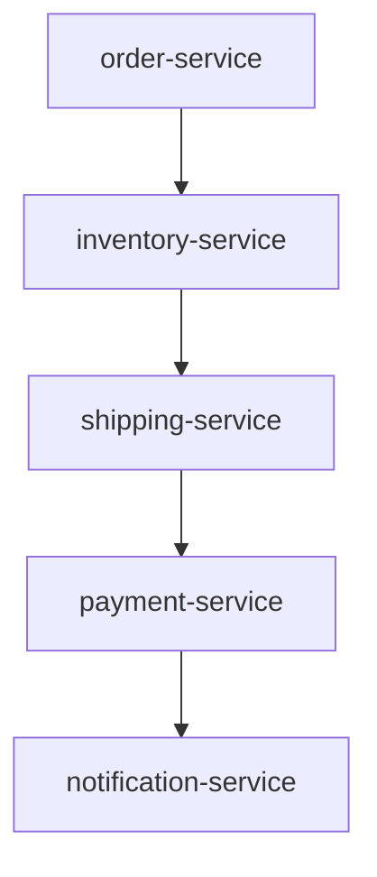
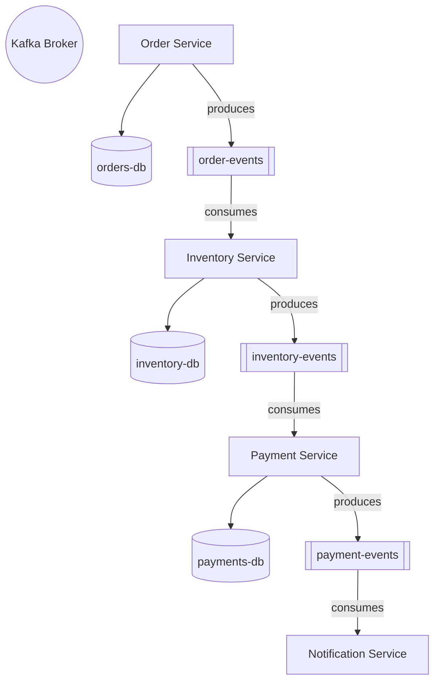
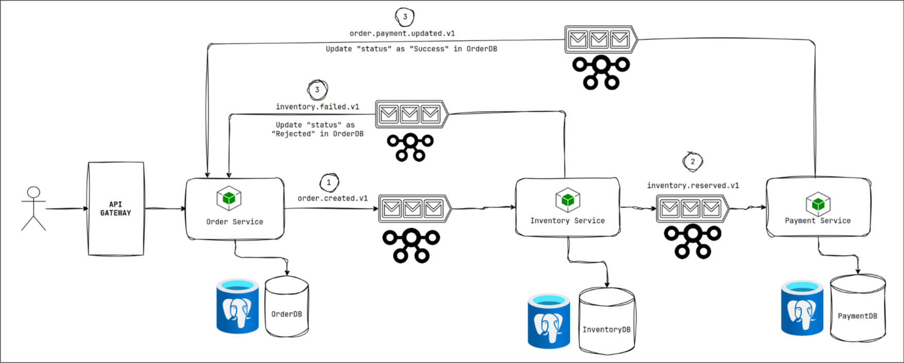

## Services

## Database

# 🛒 Order Processing System – Microservices Architecture

A Kafka-based microservices project implementing a distributed **Order Processing System**, comprised of three independent services: **Order**, **Inventory**, and **Payment**. These services communicate asynchronously using Kafka topics to ensure loose coupling and high scalability.

## Diagram

## 📦 Microservices

### 1. **Order Service**

- Accepts customer orders.
- Publishes events to Kafka.
- Listens for payment status updates.

### 2. **Inventory Service**

- Listens for new order events.
- Checks and reserves inventory.
- Publishes success or failure events.

### 3. **Payment Service**

- Listens for reserved inventory events.
- Simulates/generates payment.
- Updates payment status.

Each service has its own isolated **PostgreSQL** database instance for data encapsulation and autonomy (following the **Database per Service** pattern).

---

## 🔄 Kafka Topics

| Kafka Topic                | Description                                            | Publisher         | Subscriber(s)                     |
| -------------------------- | ------------------------------------------------------ | ----------------- | --------------------------------- |
| `order.created.v1`         | Published when a new order is created.                 | Order Service     | Inventory Service                 |
| `inventory.reserved.v1`    | Published after inventory is successfully reserved.    | Inventory Service | Payment Service                   |
| `inventory.failed.v1`      | Published if inventory reservation fails.              | Inventory Service | Order Service                     |
| `payment.generated.v1`     | Published when payment is generated/simulated.         | Payment Service   | Order Service                     |
| `order.payment.updated.v1` | Published to notify order status update after payment. | Order Service     | (For downstream services, if any) |

---
