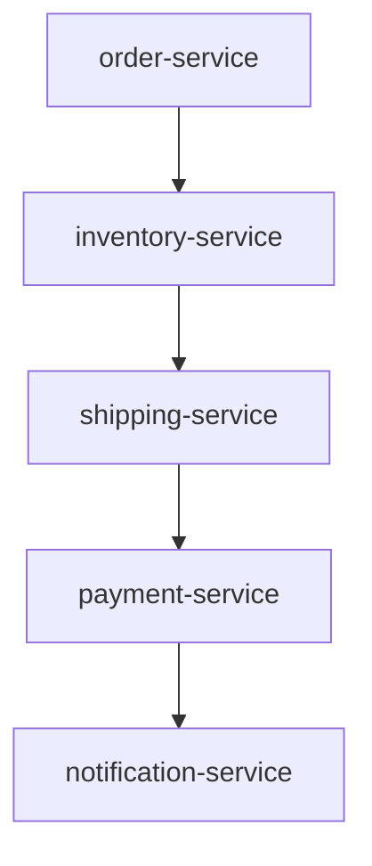
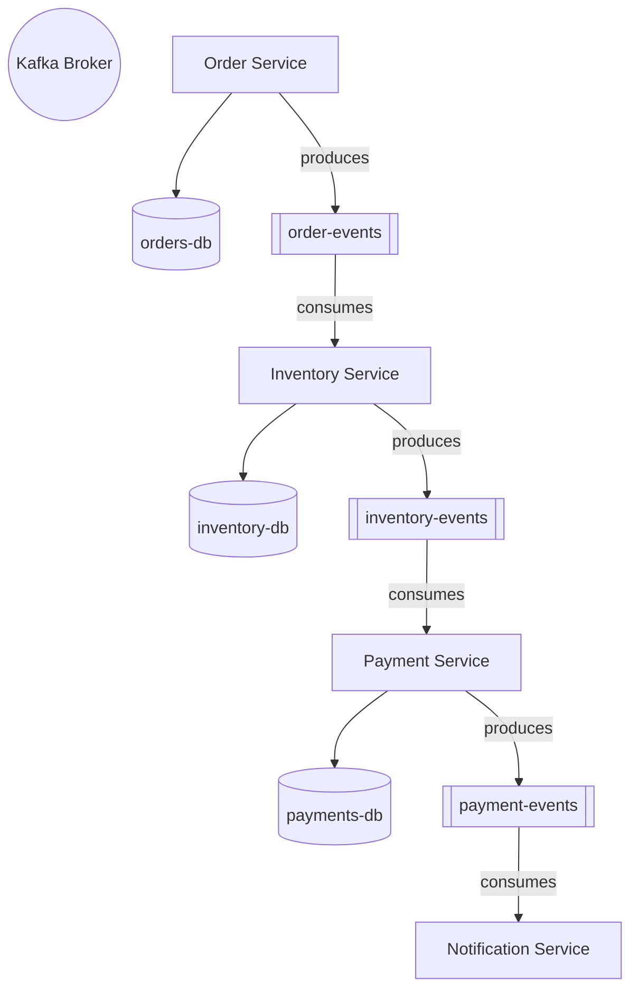

## Services

```mermaid
graph TD
  order-service --> inventory-service
  inventory-service --> shipping-service
  shipping-service --> payment-service
  payment-service --> notification-service
```

## Database

```mermaid
graph TD
  %% Kafka cluster
  Kafka((Kafka Broker))

  %% Microservices
  OrderService[Order Service]
  InventoryService[Inventory Service]
  PaymentService[Payment Service]
  NotificationService[Notification Service]

  %% Databases
  OrderDB[(orders-db)]
  InventoryDB[(inventory-db)]
  PaymentDB[(payments-db)]

  %% Kafka Topics
  OrderTopic[[order-events]]
  InventoryTopic[[inventory-events]]
  PaymentTopic[[payment-events]]

  %% Service → Kafka Topic (produces)
  OrderService -->|produces| OrderTopic
  InventoryService -->|produces| InventoryTopic
  PaymentService -->|produces| PaymentTopic

  %% Kafka Topic → Service (consumes)
  OrderTopic -->|consumes| InventoryService
  InventoryTopic -->|consumes| PaymentService
  PaymentTopic -->|consumes| NotificationService

  %% Databases per service
  OrderService --> OrderDB
  InventoryService --> InventoryDB
  PaymentService --> PaymentDB

```
